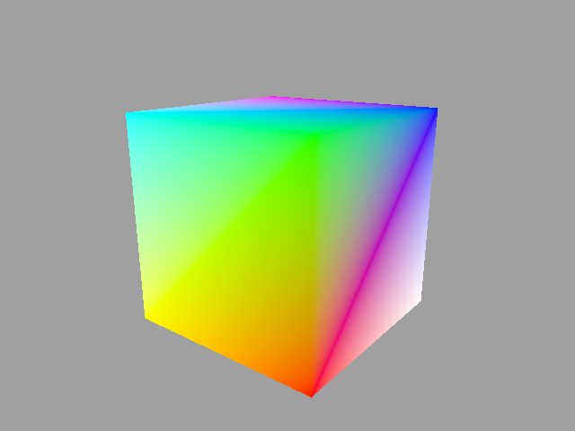
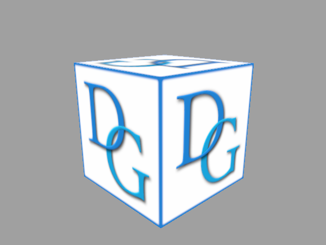
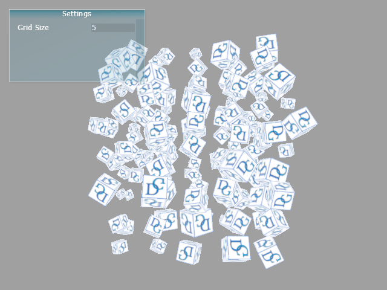

# DiligentSamples

This module contains simple graphics applications intended to demonstrate the usage of the Diligent Engine API.

# Tutorials

## [Tutorial 01 - Hello Triangle](Tutorials/Tutorial01_HelloTriangle)

This tutorial shows how to render a simple triangle using Diligent Engine API.

## [Tutorial 02 - Cube](Tutorials/Tutorial02_Cube)

This tutorial demonstrates how to render an actual 3D object, a cube. It shows how to load shaders from files, create and use vertex, 
index and uniform buffers.

## [Tutorial 03 - Texturing](Tutorials/Tutorial03_Texturing)

This tutorial demonstrates how to apply a texture to a 3D object. It shows how to load a texture from file, create shader resource
binding object and how to sample a texture in the shader.

## [Tutorial 04 - Instancing](Tutorials/Tutorial04_Instancing)

This tutorial demonstrates how to use instancing to render multiple copies of one object
using unique transformation matrix for every copy.

## [Tutorial 05 - Texture Array](Tutorials/Tutorial05_TextureArray)

This tutorial demonstrates how to combine instancing with texture arrays to 
use unique texture for every instance.

# Samples

## AntTweakBar Sample

This sample demonstrates how to use [AntTweakBar library](http://anttweakbar.sourceforge.net/doc) to create simple user interface. 
It can also be thought of as Diligent Engine’s “Hello World” example. 

## Atmospheric Light Scattering sample

The sample demonstrates how Diligent Engine can be used to implement various rendering tasks: 
loading textures from files, using complex shaders, rendering to textures, using compute shaders 
and unordered access views, etc.

# Build and Run Instructions

## Windows Desktop

Please visit [this page](http://diligentgraphics.com/diligent-engine/getting-started/#Build-Windows) for build instructions.

To run a sample from Visual Studio, locate the sample’s project in the solution explorer, set the project as 
startup project and run it. For samples to run properly, the assets folder needs to be set up as a working directory (this is automatically configured by CMake). By default the sample will run in D3D11 mode. To use D3D12 or OpenGL, use the following command 
line option: mode={D3D11|D3D12|GL} (do not use spaces!).

## Universal Windows Platform

Please visit [this page](http://diligentgraphics.com/diligent-engine/getting-started/#Build-Windows-Store) for build instructions.

To run a sample from Visual Studio, locate the sample’s project under Samples folder in the solution explorer, 
set the project as startup project, deploy and run it. On Universal Windows Platform, only D3D11 or D3D12 mode 
is available.

## Android

Please visit [this page](http://diligentgraphics.com/diligent-engine/getting-started/#Build-Android) for build instructions.

You can use Android Studio to build, deploy and run samples.

# Version History

## v2.1.a

* Refactored build system to use CMake and Gradle for Android
* Added support for Linux platform

## v2.1

## v2.0.alpha

## v1.0.0

Initial release

# License

Licensed under the [Apache License, Version 2.0](License.txt)

**Copyright 2015-2016 Egor Yusov**
