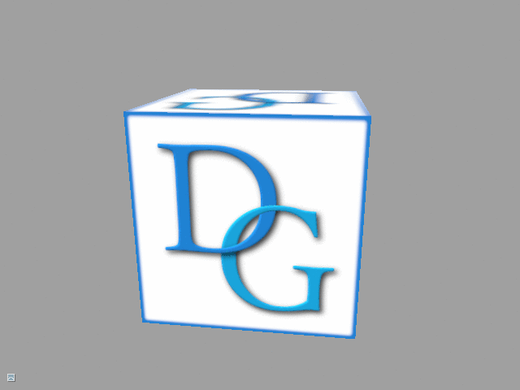
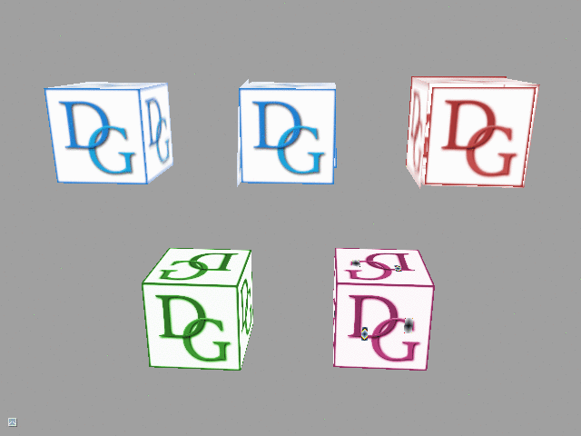
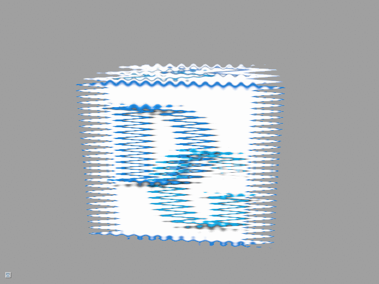

# DiligentSamples 


This module contains tutorials and sample applications intended to demonstrate the usage of [Diligent Engine](https://github.com/DiligentGraphics/DiligentEngine). The module depends on the [Core](https://github.com/DiligentGraphics/DiligentCore) and [Tools](https://github.com/DiligentGraphics/DiligentTools) submodules.

To build and run the applications in the module, please follow the [instructions](https://github.com/DiligentGraphics/DiligentEngine#build-and-run-instructions) in the master repository.

[](License.txt)
[](https://gitter.im/diligent-engine)


# Tutorials

## [Tutorial 01 - Hello Triangle](Tutorials/Tutorial01_HelloTriangle)


This tutorial shows how to render simple triangle using Diligent Engine API.


## [Tutorial 02 - Cube](Tutorials/Tutorial02_Cube)


This tutorial demonstrates how to render an actual 3D object, a cube. It shows how to load shaders from files, create and use vertex, 
index and uniform buffers.


## [Tutorial 03 - Texturing](Tutorials/Tutorial03_Texturing)



This tutorial demonstrates how to apply a texture to a 3D object. It shows how to load a texture from file, create shader resource
binding object and how to sample a texture in the shader.


## [Tutorial 04 - Instancing](Tutorials/Tutorial04_Instancing)


This tutorial demonstrates how to use instancing to render multiple copies of one object
using unique transformation matrix for every copy.


## [Tutorial 05 - Texture Array](Tutorials/Tutorial05_TextureArray)


This tutorial demonstrates how to combine instancing with texture arrays to 
use unique texture for every instance.


## [Tutorial 06 - Multithreading](Tutorials/Tutorial06_Multithreading)


This tutorial shows how to generate command lists in parallel from multiple threads.


## [Tutorial 07 - Geometry Shader](Tutorials/Tutorial07_GeometryShader)


This tutorial shows how to use geometry shader to render smooth wireframe.


## [Tutorial 08 - Tessellation](Tutorials/Tutorial08_Tessellation)


This tutorial shows how to use hardware tessellation to implement simple adaptive terrain 
rendering algorithm.


## [Tutorial 09 - Quads](Tutorials/Tutorial09_Quads)


This tutorial shows how to render multiple 2D quads, frequently swithcing textures and blend modes.


## [Tutorial 10 - Data Streaming](Tutorials/Tutorial10_DataStreaming)


This tutorial shows dynamic buffer mapping strategy using `MAP_FLAG_DISCARD` and `MAP_FLAG_DO_NOT_SYNCHRONIZE`
flags to efficiently stream varying amounts of data to GPU.


## [Tutorial 11 - Resource Updates](Tutorials/Tutorial11_ResourceUpdates)



This tutorial demonstrates different ways to update buffers and textures in Diligent Engine and explains 
important internal details and performance implications related to each method.


## [Tutorial 12 - Render Target](Tutorials/Tutorial12_RenderTarget)



This tutorial demonstrates how to render a 3d cube into an offscreen render target and do a simple
post-processing effect.


## [Tutorial 13 - Shadow Map](Tutorials/Tutorial13_ShadowMap)


This tutorial demonstrates how to render basic shadows using a shadow map.


## [Tutorial 14 - Compute Shader](Tutorials/Tutorial14_ComputeShader)

This tutorial shows how to implement a simple particle simulation system using compute shaders.


# Samples

## [Atmospheric Light Scattering sample](Samples/Atmosphere)


This sample demonstrates how to integrate
[Epipolar Light Scattering](https://github.com/DiligentGraphics/DiligentFX/tree/master/Postprocess/EpipolarLightScattering)
post-processing effect into an application to render physically-based atmosphere.

## [GLTF Viewer](Samples/GLTFViewer)

|||
|-----------------|-----------------|
|  |  |
|      |   |

This sample demonstrates how to use the [Asset Loader](https://github.com/DiligentGraphics/DiligentTools/tree/master/AssetLoader)
and [GLTF PBR Renderer](https://github.com/DiligentGraphics/DiligentFX/tree/master/GLTF_PBR_Renderer) to load and render GLTF models.


## [Shadows](Samples/Shadows)


This sample demonstrates how to integrate the [Shadowing component](https://github.com/DiligentGraphics/DiligentFX/tree/master/Components#shadows)
into an application to render high-quality shadows.


# Build and Run Instructions

Please refer to Build and Run Instructions section in the
[master repository's readme](https://github.com/DiligentGraphics/DiligentEngine/blob/master/README.md#build-and-run-instructions).

Command line options:

* **-mode** {*d3d11*|*d3d12*|*vk*|*gl*} - select rendering back-end (exmple: *-mode d3d12*).
* **-width** *value* - set desired window width (example: *-width 1024*).
* **-height** *value* - set desired window height (example: *-height 768*).
* **-capture_path** *path* - path to the folder where screen captures will be saved. Specifying this parameter enables screen capture (example: *-capture_path .*).
* **-capture_name** *name* - screen capture file name. Specifying this parameter enables screen capture (example: *-capture_name frame*).
* **-capture_fps** *fps*   - recording fps when capturing frame sequence (example: *-capture_fps 10*). Default value: 15.
* **-capture_frames** *value* - number of frames to capture after the app starts (example: *-capture_frames 50*).
* **-capture_format** {*jpg*|*png*} - image file format (example: *-capture_format jpg*). Default value: jpg.
* **-capture_quality** *value* - jpeg quality (example: *-capture_quality 80*). Default value: 95.
* **-capture_alpha** *value* - when saving png, whether to write alpha channel (example: *-capture_alpha 1*). Default value: false.

When image capture is enabled the following hot keys are available:

* **F2** starts frame capture recording.
* **F3** finishes frame capture recroding.
* **F4** saves single screenshot.

To record multiple frames after the app starts, use command line like this:

```
-mode d3d12 -capture_path . -capture_fps 15 -capture_name frame -width 640 -height 480 -capture_format png -capture_frames 50
```

# License

See [Apache 2.0 license](License.txt).

This project has some third-party dependencies, each of which may have independent licensing:

* [AntTweakBar](http://anttweakbar.sourceforge.net/doc): A simple user interface library.


<a name="contributing"></a>
# Contributing

To contribute your code, submit a [Pull Request](https://github.com/DiligentGraphics/DiligentSamples/pulls) 
to this repository. **Diligent Engine** is licensed under the [Apache 2.0 license](License.txt) that guarantees 
that code in the **DiligentSamples** repository is free of Intellectual Property encumbrances. In submitting code to
this repository, you are agreeing that the code is free of any Intellectual Property claims.  


------------------------------

[diligentgraphics.com](http://diligentgraphics.com)

[](https://twitter.com/diligentengine)
[](https://www.facebook.com/DiligentGraphics/)
