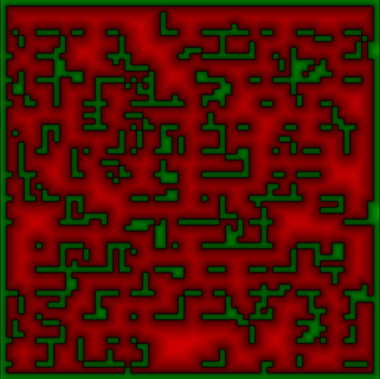

# GLFW Demo

This sample demonstrates how to use [GLFW](https://www.glfw.org/) to create window and handle keyboard and mouse input instead of Diligent-NativeAppBase.

## Initialization

GLFW natively supports only OpenGL (ES) and Vulkan.
To use all available graphics APIs we should create a GLFW window with GLFW_NO_API flag and create a swapchain using DiligentEngine methods.
```cpp
glfwInit();
glfwWindowHint(GLFW_CLIENT_API, GLFW_NO_API);

m_Window = glfwCreateWindow(Width, Height, Title, nullptr, nullptr);
```

To create a swapchain we need to initialize the `NativeWindow` structure.
Include `glfw3native.h` and set native window handles to the `NativeWindow`.
```cpp
#if PLATFORM_WIN32
    Win32NativeWindow Window{glfwGetWin32Window(m_Window)};
#endif
#if PLATFORM_LINUX
    LinuxNativeWindow Window;
    Window.WindowId = glfwGetX11Window(m_Window);
    Window.pDisplay = glfwGetX11Display();
#endif
#if PLATFORM_MACOS
    MacOSNativeWindow Window{GetNSWindowView(m_Window)};
#endif
```

On MacOS we additionally create `CAMetalLayer` to allow rendering into view using Metal API.
```cpp
void* GetNSWindowView(GLFWwindow* wnd)
{
    id Window = glfwGetCocoaWindow(wnd);
    id View   = [Window contentView];
    
    NSBundle* bundle = [NSBundle bundleWithPath:@"/System/Library/Frameworks/QuartzCore.framework"];
    if (!bundle)
        return nullptr;
    
    id Layer = [[bundle classNamed:@"CAMetalLayer"] layer];
    if (!Layer)
        return nullptr;
    
    [View setLayer:Layer];
    [View setWantsLayer:YES];
    
    return View;
}
```

## Game

Simple game demonstrates how to handle GLFW keyboard and mouse events.<br/>
<br/>
Controls:
To move player use `WASD` or arrows or numpad arrows.<br/>
To generate new map press `Tab`.<br/>
To exit game press `Ecs`.<br/>
Press left mouse button to activate flashlight.<br/>
<br/>
There are no pre-drawn textures and meshes in this game, only procedural content.
Labyrinth is randomly generated, the target point placed to the empty space near to the map border, there is no warranty that target point can be reached.
For rendering the game uses signed distance fields (SDF). These algorithms may have performance issues on old GPUs because of using loops and dynamic branching.

The map is a 16-bit floating point single channel texture that contains:
* distance from empty space to the nearest wall, this distance has positive sign (red color).
* distance from wall to nearest pixel with empty space, this distance has negative sign (green color).


The player shape and light around the player is a circle with attenuation from center to border.
Circle function is a distance from the current pixel to a player position.
```cpp
float  DistToPlayer   = distance(PosOnMap, g_PlayerConstants.PlayerPos);
float Factor = saturate(1.0 - DistToPlayer / g_PlayerConstants.PlayerRadius);
Color.rgb    = Blend(Color.rgb, PlayerColor, Factor);
```

Target point (or a teleport to the next map) draws as a circle and additionally have a wave animation.
```cpp
const float DistToTeleport = distance(PosOnMap, g_MapConstants.TeleportPos);
const float WaveWidth = 0.2;
float       Wave      = BumpStep(DistToTeleport, g_MapConstants.TeleportWaveRadius, g_MapConstants.TeleportWaveRadius + WaveWidth);
Color.rgb             = Blend(Color.rgb, TeleportWaveColor, Wave);
```
`BumpStep()` converts distance in range [0, inf] to range [WaveRadius, WaveRadius + WaveWidth], then converts it to triangle wave `/\/\` in range [0, 1]. It looks like a outline circle.<br/>
`TeleportWaveRadius` animated with function `WaveRadius = fract(WaveRadius + TimeDelta)` this produces another triangle wave `/|/|` and looks like a circle with increasing radius from 0 to 1 and again.<br/>

Flashlight uses a bit complex function.
At first we calculate the distance from the current pixel to the flashlight ray. Calculate A,B,C coefficients of the line equation `Ax + By + C = 0` and get minimal distance from point to a ray.
```cpp
float2 Dir       = g_PlayerConstants.FlashLightDir;
float2 Begin     = g_PlayerConstants.PlayerPos;
float2 End       = Begin + Dir;
float  A         = Begin.y - End.y;
float  B         = End.x - Begin.x;
float  C         = Begin.x * End.y - End.x * Begin.y;
float  DistToRay = abs((A * PosOnMap.x + B * PosOnMap.y + C) / sqrt(A * A + B * B));
```

This code can be simplified to:
```cpp
float  DistToRay = abs((-Dir.y * PosOnMap.x) + (Dir.x * PosOnMap.y) + (Begin.x * End.y - End.x * Begin.y));
```

Radius of the light cone calculated as `ConeHeight * tan(Angle)/2`
```cpp
float  TanOfAngle = 0.5; // tan(45 degrees) * 0.5
float  ConeRadius = DistToPlayer * TanOfAngle;
```

The light will attenuate depending on the square of the distance.
```cpp
float  Atten  = DistToPlayer / g_PlayerConstants.FlshLightMaxDist;
Atten         = saturate(1.0 - Atten * Atten);
float  Factor = saturate(1.0 - DistToRay / ConeRadius) * g_PlayerConstants.FlashLightPower * Atten;
LightColor    = Blend(LightColor, FlashLightColor, Factor);
```

To cast shadows we use the sphere tracing algorithm on the signed distance field.
We trace ray from current pixel position to the light source position, function return 1 if there are no intersections and pixel can be illuminated.
All coordinates and distances here are in SDF texture pixel space.
```cpp
float TraceRay(float2 LightPos, float2 Origin)
{
    const float  TMax    = distance(LightPos, Origin);   // distance from current pixel to light source.
    const float  MinDist = 0.00625;                      // some minimal value.
    const int    MaxIter = 128;                          // maximum number of loop cycles to prevent infinite loops.
    const float2 Dir     = normalize(LightPos - Origin); // ray marching direction.
    float2       Pos     = Origin;                       // ray marching start position.
    float        t       = 0.0;                          // ray length

    for (int i = 0; i < MaxIter; ++i)
    {
        // read the maximum radius of the sphere inside which there are no intersections
        float d = ReadSDF(Pos);

        // stop ray marching on negative or too small distance
        if (d < MinDist)
            break;

        // me can increase ray length to the sphere radius
        t += d;

        // calculate new position
        Pos = Origin + Dir * t;

        // stop ray marching if ray distance is equal or greater than distance from current pixel to the light source
        if (t > TMax)
            break;
    }
    return t > TMax ? 1.0 : 0.0;
}
```

We can cast additional rays to implement soft shadows.
```cpp
float Shading = TraceRay(g_PlayerConstants.PlayerPos, PosOnMap) * 0.5;

float2 Norm = float2(-DirToPlayer.y, DirToPlayer.x); // left normal to the line
Shading += TraceRay(g_PlayerConstants.PlayerPos, PosOnMap + Norm * 0.125) * 0.25;
Shading += TraceRay(g_PlayerConstants.PlayerPos, PosOnMap - Norm * 0.125) * 0.25;
```
