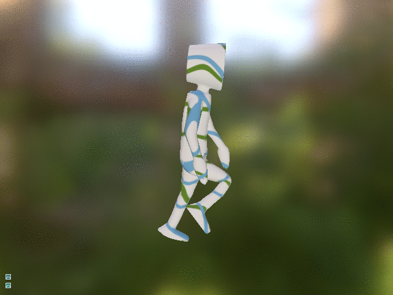

# GLTF Viewer

This sample demonstrates how to use the [Asset Loader](https://github.com/DiligentGraphics/DiligentTools/tree/master/AssetLoader)
and [GLTF PBR Renderer](https://github.com/DiligentGraphics/DiligentFX/tree/master/PBR) to load and render GLTF models.

| | |
|-----------------|-----------------|
|  |  |
|      |   |

[:arrow_forward: Run in the browser](https://diligentgraphics.github.io/wasm-modules/GLTFViewer/GLTFViewer.html)

Additional models can be downloaded from [Khronos GLTF sample models repository](https://github.com/KhronosGroup/glTF-Sample-Models).

**Command Line Arguments**

| Argument                     |          Description               |
|------------------------------|------------------------------------|
| `--use_cache {0,1}`		   | Enable/disable GLTF resource cache |
| `--model <path>`			   | Path to the GLTF model to load     |
| `--compute_bounds {0,1}`	   | Compute bounding boxes for primitives in the model |
| `--tex_array {none,static}`  | Texture array mode:   - `none` - use separate textures for each material   - `static` - use static texture indexing (see `PBR_Renderer::SHADER_TEXTURE_ARRAY_MODE_STATIC`) |
| `--dir <path>`, `-d <path>`  | Add GLTF models from the specified directory to the list of available models |
| `--ext`, `-e`				   | GLTF model search patterns to use when searching the directories specified with `--dir` separated by `';'` (default: `*.gltf`) |
