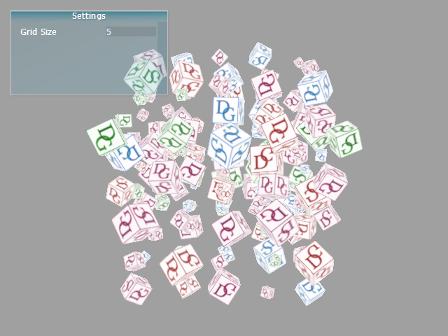

# Tutorial05 - Texture Array

This tutorial demonstrates how to combine instancing shown in Tutotial04 with texture arrays to 
use unique texture for every instance.



Texture array is a special kind of texture that consists of multiple 2D (or 1D) textures sharing the same
format, size, and the number of mip levels. Every individual texture in the array is called *slice*. Slices can
be dynamically indexed by the shaders which enables a number of useful techniques such as selecting different slices 
for different instances.

## Shaders

Vertex shader is mostly similar to the one from Tutorial04, but uses one more per-instance attribute, texture
array index that it passes to the pixel shader:

```hlsl
struct PSInput 
{ 
    float4 Pos : SV_POSITION; 
    float2 uv : TEX_COORD; 
    float TexIndex : TEX_ARRAY_INDEX;
};

PSInput main(// ...
             // ...
             float TexArrInd : ATTRIB6) 
{
    // ...
    ps.TexIndex = TexArrInd;
    return ps;
}
```

Pixel shader declares `Texture2DArray` variable `g_Texture` and uses the index passed from the
vertex shader to select the slice. When sampling a texture array, 3-component vector is used as the texture
coordinate, where the third component defines the slice.

```hlsl
Texture2DArray g_Texture;
SamplerState g_Texture_sampler;

struct PSInput 
{ 
    float4 Pos : SV_POSITION; 
    float2 uv : TEX_COORD; 
    float TexIndex : TEX_ARRAY_INDEX;
};

float4 main(PSInput ps_in) : SV_TARGET
{
    return g_Texture.Sample(g_Texture_sampler, float3(ps_in.uv, ps_in.TexIndex)); 
}
```

## Initializing the Pipeline State

Pipeline state is initialized in the same way as in Tutorial04. The only difference is that the vertex layout
defines one additional per-instance attribute, texture array index:

```cpp
LayoutElement LayoutElems[] =
{
    // ...
    // Attribute 6 - texture array index
    LayoutElement{6, 1, 1, VT_FLOAT32, False, LayoutElement::AutoOffset, LayoutElement::AutoStride, LayoutElement::FREQUENCY_PER_INSTANCE},
};
```

## Loading Texture Array

Texture loading library does not provide a function that loads texture array.
Instead, every individual texture needs to be loaded and then copied to the 
appropriate texture array slice, one mip level at a time.

```cpp
RefCntAutoPtr<ITexture> pTexArray;
for(int tex=0; tex < NumTextures; ++tex)
{
    // Load current texture
    TextureLoadInfo loadInfo;
    loadInfo.IsSRGB = true;
    RefCntAutoPtr<ITexture> SrcTex;
    std::stringstream FileNameSS;
    FileNameSS << "DGLogo" << tex << ".png";
    auto FileName = FileNameSS.str();
    CreateTextureFromFile(FileName.c_str(), loadInfo, m_pDevice, &SrcTex);
    const auto &TexDesc = SrcTex->GetDesc();
    if (pTexArray == nullptr)
    {
		//	Create texture array
        auto TexArrDesc = TexDesc;
        TexArrDesc.ArraySize = NumTextures;
        TexArrDesc.Type = RESOURCE_DIM_TEX_2D_ARRAY;
        TexArrDesc.Usage = USAGE_DEFAULT;
        TexArrDesc.BindFlags = BIND_SHADER_RESOURCE;
        m_pDevice->CreateTexture(TexArrDesc, nullptr, &pTexArray);
    }
    // Copy current texture into the texture array
    for(Uint32 mip=0; mip < TexDesc.MipLevels; ++mip)
    {
        pTexArray->CopyData(m_pImmediateContext, SrcTex, mip, 0, nullptr, mip, tex, 0, 0, 0);
    }
}
// Get shader resource view from the texture array
m_TextureSRV = pTexArray->GetDefaultView(TEXTURE_VIEW_SHADER_RESOURCE);
```


The only last detail that is different from Tutorial04 is that `PopulateInstanceBuffer()` function computes
texture array index, for every instance, and writes it to the instance buffer along with the transform matrix.