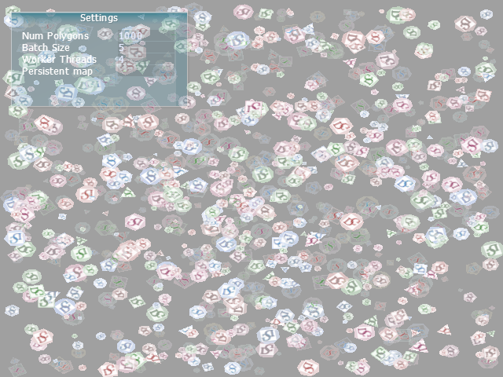

# Tutorial10 - Streaming

This tutorial shows dynamic buffer mapping strategy using `MAP_FLAG_DISCARD` and `MAP_FLAG_DO_NOT_SYNCHRONIZE`
flags to efficiently stream varying amounts of data to GPU.



The tutorial is based on [Tutorial09 - Quads](../Tutorial09_Quads), but instead of quads it renders polygons
with varying number of vertices, streaming geometry of every polygon at every draw call.

## Streaming Data

The main difference between this and previous tutorial is that this time the geometry of every polygon is not fixed and
change dynamically at run time. Before issuing a draw command, polygon vertices and index list are streamed to the GPU.
The sample employs the following strategy to upload varying amounts of data to the GPU:

1. Create dynamic buffer large enough to encompass few polygons
2. First time, map the buffer with `MAP_FLAG_DISCARD` flag. This will discard previous buffer contents and allocate new memory.
3. Set current buffer offset to zero, write polygon data to the buffer and update offset
4. Unmap the buffer and issue draw command. Note that in Direct3D12 and Vulkan backends, unmapping the buffer is not required
   and can be safely skipped to improve performance
5. When mapping the buffer next time, check if remaining space is enough to encompass the new polygon data.
   * If there is enough space, map the buffer with `MAP_FLAG_DO_NOT_SYNCHRONIZE` flag. This will tell the system 
     to return previously allocated memory. It is the responsibility of the application to not overwrite the memory that 
     is in use by the GPU. Write polygon data at current offset and update the offset.
   * If there is not enough space, reset the offset to zero and map the buffer with `MAP_FLAG_DISCARD` flag to request new
     chunk of memory

The strategy described above is implemented by `StreamingBuffer` class:

```cpp
class StreamingBuffer
{
public:
    // ... 

private:
    RefCntAutoPtr<IBuffer> m_pBuffer;
    const Uint32 m_BufferSize;
    bool m_AllowPersistentMap = false;
    
    struct MapInfo
    {
        MapHelper<void*> m_MappedData;
        Uint32 m_CurrOffset = 0;
    };
    // We need to keep track of mapped data for every context
    std::vector<MapInfo> m_MapInfo;
};
```

The class constructor simply initializes the dynamic buffer to hold streaming data:

```cpp
StreamingBuffer::StreamingBuffer(IRenderDevice* pDevice, BIND_FLAGS BindFlags, Uint32 Size, size_t NumContexts) : 
    m_BufferSize            (Size),
    m_MapInfo               (NumContexts)
{
    BufferDesc BuffDesc;
    BuffDesc.Name           = "Data streaming buffer";
    BuffDesc.Usage          = USAGE_DYNAMIC;
    BuffDesc.BindFlags      = BindFlags;
    BuffDesc.CPUAccessFlags = CPU_ACCESS_WRITE;
    BuffDesc.uiSizeInBytes  = Size;
    pDevice->CreateBuffer(BuffDesc, BufferData(), &m_pBuffer);
}
```

The allocation strategy described above is implemented by `Allocate()` method:

```cpp
// Returns offset of the allocated region
Uint32 StreamingBuffer::Allocate(IDeviceContext* pCtx, Uint32 Size, size_t CtxNum)
{
    auto& MapInfo = m_MapInfo[CtxNum];
    // Check if there is enough space in the buffer
    if (MapInfo.m_CurrOffset + Size > m_BufferSize)
    {
        // Unmap the buffer
        Flush(CtxNum);
    }
        
    if (MapInfo.m_MappedData == nullptr)
    {
        // If current offset is zero, we are mapping the buffer for the first time after it has been flushed. Use MAP_FLAG_DISCARD flag.
        // Otherwise use MAP_FLAG_DO_NOT_SYNCHRONIZE flag.
        MapInfo.m_MappedData.Map(pCtx, m_pBuffer, MAP_WRITE, MapInfo.m_CurrOffset == 0 ? MAP_FLAG_DISCARD : MAP_FLAG_DO_NOT_SYNCHRONIZE);
    }

    auto Offset = MapInfo.m_CurrOffset;
    // Update offset
    MapInfo.m_CurrOffset += Size;
    return Offset;
}
```

Writing data to the buffer is than straightforward:

```cpp
auto VBOffset = m_StreamingVB->Allocate(pCtx, NumVerts * sizeof(float2), CtxNum);
auto* VertexData = reinterpret_cast<float2*>(reinterpret_cast<Uint8*>(m_StreamingVB->GetMappedCPUAddress(CtxNum)) + VBOffset);
// Write required data to VertexData
// ... 

m_StreamingVB->Release(CtxNum);
```

After the data has been written, the last thing to do is to bind the buffers at the specified offsets:

```cpp
Uint32 offsets[] = { VBOffset };
IBuffer *pBuffs[] = { m_StreamingVB->GetBuffer() };
pCtx->SetVertexBuffers(0, 1, pBuffs, offsets, SET_VERTEX_BUFFERS_FLAG_RESET);
pCtx->SetIndexBuffer(m_StreamingIB->GetBuffer(), IBOffsets);
```


Shader and pipeline state inititalization as well as multithreaded rendering is done similar to previous sample; refer to 
[Tutorial09 - Quads](../Tutorial09_Quads) for details.