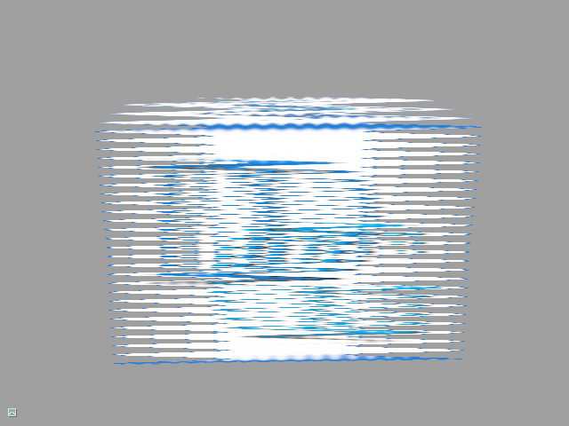

# Tutorial12 - Render Target

This tutorial is a mix of Tutorial01 and Tutorial02 which demonstrates how to render a 3d cube into
an offscreen render target and do a simple distortion post-processing effect. Note that this tutorial
assumes that you are familiar with all basics covered from Tutorial01 to Tutorial03.



## Shaders

The cube's vertex shader generates the geometry procedurally using an array of hard-coded vertex
positions in screen space and colors. The shader also uses a world-view-projection matrix defined
in a constant (uniform) buffer called `Constants` to transform vertex positions:

```hlsl
cbuffer Constants
{
    float4x4 g_WorldViewProj;
};

struct VSInput
{
    uint VertexID : SV_VertexID;
};

struct PSInput
{
    float4 Pos    : SV_POSITION;
    float4 Color  : COLOR0;
};

void main(in  VSInput VSIn,
          out PSInput PSIn)
{
    float3 Pos[8];
    Pos[0] = float3(-1.0, -1.0, -1.0);
    Pos[1] = ...

    float3 Color[8];
    Color[0] = float3(0.0, 0.0, 0.0);
    Color[1] = ...

    uint Indices[] =
    {
        ...
    };

    uint VertexID = Indices[VSIn.VertexID];
    PSIn.Pos = mul(float4(Pos[VertexID], 1.0), g_WorldViewProj);
    PSIn.Color = float4(Color[VertexID], 1.0);
}
```

The render target's vertex shader generates the geometry procedurally using an array of hard-coded
vertex positions and UV coordinates.

```hlsl
struct VSInput
{
    uint VertexID : SV_VertexID;
};

struct PSInput
{
    float4 Pos    : SV_POSITION;
    float2 UV     : TEX_COORD;
};

void main(in  VSInput VSIn,
          out PSInput PSIn)
{
    float4 Pos[4];
    ... 

    float2 UV[4];
    ...

    PSIn.Pos = Pos[VSIn.VertexID];
    PSIn.UV = UV[VSIn.VertexID];
}

```

Unlike other graphics API's, OpenGL has its texture coordinates origin at the bottom-left corner instead of the top left.
When sampling a regular texture, there is no visible difference since the texture data is also uploaded starting from
that lower-left corner. When sampling a framebuffer attachment, there is a visible difference, though. Hence we need
to flip the Y coordinate of the frame buffer attachment in OpenGL and OpenGL ES.

```hlsl
Texture2D    g_Texture;
SamplerState g_Texture_sampler;

struct PSInput
{
    float4 Pos   : SV_POSITION;
    float2 UV    : TEX_COORD;
};

struct PSOutput
{
    float4 Color : SV_TARGET;
};

void main(in  PSInput  PSIn,
          out PSOutput PSOut)
{
#if defined(DESKTOP_GL) || defined(GL_ES)
    float2 UV = float2(PSIn.UV.x, 1.0 - PSIn.UV.y);
#else
    float2 UV = PSIn.UV;
#endif

    float2 DistortedUV = UV + float2(sin(UV.y*30.0)*0.1 * sin(g_Time.x*3.0), sin(UV.x*20.0)*0.02 * sin(g_Time.x*2.0));
    PSOut.Color = g_Texture.Sample(g_Texture_sampler, DistortedUV);
}
```

## Initializing the Pipeline State

Since the rendering of our cubes will be done into our render target, we must ensure that the
color and depth formats match those we'll use for our render target's texture attachments.

```cpp
PSODesc.GraphicsPipeline.NumRenderTargets = 1;
PSODesc.GraphicsPipeline.RTVFormats[0] = RenderTargetFormat;
PSODesc.GraphicsPipeline.DSVFormat = DepthBufferFormat;
PSODesc.GraphicsPipeline.DepthStencilDesc.DepthEnable = True;
```

## Creating Render Target

A render target is basically defined by the texture attachments it is composed of. When rendering
our cubes, the primary color output will be rendered in our color texture attachment.

```cpp
RefCntAutoPtr<ITexture> pRTColor;
TextureDesc RTColorDesc;
RTColorDesc.Type = RESOURCE_DIM_TEX_2D;
RTColorDesc.Width = pSwapChain->GetDesc().Width;
RTColorDesc.Height = pSwapChain->GetDesc().Height;
RTColorDesc.MipLevels = 1;
RTColorDesc.Format = RenderTargetFormat;
RTColorDesc.BindFlags = BIND_SHADER_RESOURCE | BIND_RENDER_TARGET;
pDevice->CreateTexture(RTColorDesc, nullptr, &pRTColor);
m_pRTColorAttachment = pRTColor->GetDefaultView(TEXTURE_VIEW_RENDER_TARGET);
```

If we need to use depth testing - which is the case in our tutorial - we also need to use a
depth texture attachment.

```cpp
RefCntAutoPtr<ITexture> pRTDepth;
TextureDesc RTDepthDesc = RTColorDesc;
RTDepthDesc.Format = DepthBufferFormat;
RTDepthDesc.BindFlags = BIND_SHADER_RESOURCE | BIND_DEPTH_STENCIL;
pDevice->CreateTexture(RTDepthDesc, nullptr, &pRTDepth);
m_pRTDepthAttachment = pRTDepth->GetDefaultView(TEXTURE_VIEW_DEPTH_STENCIL);
```

We also need to create additional shaders that will handle our simple post-processing effect.
```cpp
ShaderCreationAttribs CreationAttribs;
CreationAttribs.SourceLanguage = SHADER_SOURCE_LANGUAGE_HLSL;
CreationAttribs.UseCombinedTextureSamplers = true;
BasicShaderSourceStreamFactory BasicSSSFactory;
CreationAttribs.pShaderSourceStreamFactory = &BasicSSSFactory;
CreationAttribs.Desc.DefaultVariableType = SHADER_VARIABLE_TYPE_STATIC;

RefCntAutoPtr<IShader> pRTVS;
{
    CreationAttribs.Desc.ShaderType = SHADER_TYPE_VERTEX;
    CreationAttribs.EntryPoint = "main";
    CreationAttribs.Desc.Name = "Render Target VS";
    CreationAttribs.FilePath = "rendertarget.vsh";
    pDevice->CreateShader(CreationAttribs, &pRTVS);
}

RefCntAutoPtr<IShader> pRTPS;
{
    CreationAttribs.Desc.ShaderType = SHADER_TYPE_PIXEL;
    CreationAttribs.EntryPoint = "main";
    CreationAttribs.Desc.Name = "Render Target PS";
    CreationAttribs.FilePath = "rendertarget.psh";
    ShaderVariableDesc Vars[] =
    {
        { "g_Texture", SHADER_VARIABLE_TYPE_MUTABLE }
    };
    CreationAttribs.Desc.VariableDesc = Vars;
    CreationAttribs.Desc.NumVariables = _countof(Vars);
    StaticSamplerDesc StaticSamplers[] =
    {
        { "g_Texture", { FILTER_TYPE_LINEAR, FILTER_TYPE_LINEAR, FILTER_TYPE_LINEAR, TEXTURE_ADDRESS_CLAMP, TEXTURE_ADDRESS_CLAMP, TEXTURE_ADDRESS_CLAMP } }
    };
    CreationAttribs.Desc.StaticSamplers = StaticSamplers;
    CreationAttribs.Desc.NumStaticSamplers = _countof(StaticSamplers);
    pDevice->CreateShader(CreationAttribs, &pRTPS);
}
```

Then, we need to create another pipeline state object that will store all the information
required to render our small post-processing effect.

```cpp
PipelineStateDesc RTPSODesc;
RTPSODesc.Name = "Render Target PSO";
RTPSODesc.IsComputePipeline = false;
RTPSODesc.GraphicsPipeline.NumRenderTargets = 1;
RTPSODesc.GraphicsPipeline.RTVFormats[0] = pSwapChain->GetDesc().ColorBufferFormat;
RTPSODesc.GraphicsPipeline.DSVFormat = pSwapChain->GetDesc().DepthBufferFormat;
RTPSODesc.GraphicsPipeline.PrimitiveTopology = PRIMITIVE_TOPOLOGY_TRIANGLE_STRIP;
RTPSODesc.GraphicsPipeline.RasterizerDesc.CullMode = CULL_MODE_BACK;
RTPSODesc.GraphicsPipeline.DepthStencilDesc.DepthEnable = False;
RTPSODesc.GraphicsPipeline.pVS = pRTVS;
RTPSODesc.GraphicsPipeline.pPS = pRTPS;
pDevice->CreatePipelineState(RTPSODesc, &m_pRTPSO);
```

Eventually, we need to setup our shader resource bindings so that our post-processing effect will get a handle to our color attachment.

```cpp
m_pRTPSO->CreateShaderResourceBinding(&m_pRTSRB, true);
m_pRTSRB->GetVariable(SHADER_TYPE_PIXEL, "g_Texture")->Set(pRTColor->GetDefaultView(TEXTURE_VIEW_SHADER_RESOURCE));
```

## Rendering

There are few changes that we need to make to our rendering procedure compared to the other tutorials.
At the beginning of the frame, we need to activate our render target and clear our color and depth
attachments.

```cpp
const float ClearColor[] = { 0.350f,  0.350f,  0.350f, 1.0f };
m_pImmediateContext->SetRenderTargets(1, &m_pRTColorAttachment, m_pRTDepthAttachment, RESOURCE_STATE_TRANSITION_MODE_TRANSITION);
m_pImmediateContext->ClearRenderTarget(m_pRTColorAttachment, ClearColor, RESOURCE_STATE_TRANSITION_MODE_TRANSITION);
m_pImmediateContext->ClearDepthStencil(m_pRTDepthAttachment, CLEAR_DEPTH_FLAG, 1.0f, 0, RESOURCE_STATE_TRANSITION_MODE_TRANSITION);
```

The rendering of our cube should look quite similar to other tutorials.
```cpp
{
    MapHelper<float4x4> CBConstants(m_pImmediateContext, m_VSConstants, MAP_WRITE, MAP_FLAG_DISCARD);
    *CBConstants = transposeMatrix(m_WorldViewProjMatrix);
}
m_pImmediateContext->SetPipelineState(m_pPSO);
m_pImmediateContext->CommitShaderResources(m_pSRB, RESOURCE_STATE_TRANSITION_MODE_TRANSITION);

DrawAttribs DrawAttrs;
DrawAttrs.NumVertices = 36;
DrawAttrs.Flags = DRAW_FLAG_VERIFY_STATES;
m_pImmediateContext->Draw(DrawAttrs);
```

After we're done rendering our cubes, we need to deactivate our render target and draw a fullscreen quad
using our post-processing effet shader.

```cpp
const float Zero[] = { 0.0f,  0.0f,  0.0f, 1.0f };
m_pImmediateContext->SetRenderTargets(0, nullptr, nullptr, RESOURCE_STATE_TRANSITION_MODE_TRANSITION);
m_pImmediateContext->ClearRenderTarget(nullptr, Zero, RESOURCE_STATE_TRANSITION_MODE_TRANSITION);
m_pImmediateContext->ClearDepthStencil(nullptr, CLEAR_DEPTH_FLAG, 1.f, 0, RESOURCE_STATE_TRANSITION_MODE_TRANSITION);

m_pImmediateContext->SetPipelineState(m_pRTPSO);
m_pImmediateContext->CommitShaderResources(m_pRTSRB, RESOURCE_STATE_TRANSITION_MODE_TRANSITION);

DrawAttribs RTDrawAttrs;
RTDrawAttrs.NumVertices = 4;
RTDrawAttrs.Flags = DRAW_FLAG_VERIFY_STATES; // Verify the state of vertex and index buffers
m_pImmediateContext->Draw(RTDrawAttrs);
```
