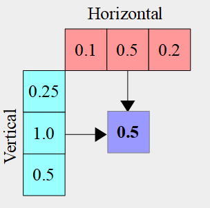

# Tutorial24 - Variable rate shading

This tutorial demonstrates how to use variable rate shading for pixel shader optimization.


## VRS in desktop GPU

Variable shading rate implementation on mobile and desktop GPUs and in different GAPIs has serious differences.
On desktop GPU variable rate shading used to change the number of pixel shader invocations per small tile,
it allows to reduce the number of heavy pixel shader invocations for areas which will be blurred by motion blur or other post processes.
Direct3D12 and Vulkan have three VRS types: per-draw, per-primitive, texture based and also a combination of these types.

### Per draw shading rate.
If capability `SHADING_RATE_CAP_FLAG_PER_DRAW` is supported then we can call `IDeviceContext::SetShadingRate()`,
where `BaseRate` is one of the supported shading rates from list in `ShadingRateProperties::ShadingRates`,
`PrimitiveCombiner` and `TextureCombiner` must be `SHADING_RATE_COMBINER_PASSTHROUGH` because they will be used by other VRS modes.

### Per primitive shading rate.
If capability `SHADING_RATE_CAP_FLAG_PER_PRIMITIVE` is supported then we can call `IDeviceContext::SetShadingRate()`,
where `PrimitiveCombiner` is one of the supported combiners in the bit field `ShadingRateProperties::Combiners`.
`SHADING_RATE_COMBINER_PASSTHROUGH` means that per-primitive VRS is not used, `SHADING_RATE_COMBINER_OVERRIDE` means that used only per-primitive VRS,
other values specify how to combine per-draw with per-primitive rates.
Per-primitive shading rate specified as output value in vertex or geometry shader:
`nointerpolation uint Rate : SV_ShadingRate;`

### Texture based shading rate.
If capability `SHADING_RATE_CAP_FLAG_TEXTURE_BASED` is supported then we cal call `IDeviceContext::SetShadingRate()`,
where `TextureCombiner`is one of the supported combiners in the bit field `ShadingRateProperties::Combiners`.
If `PrimitiveCombiner = SHADING_RATE_COMBINER_PASSTHROUGH` and `TextureCombiner = SHADING_RATE_COMBINER_OVERRIDE` then only shading rate from texture will be used,
other parameters specify a combination of all three modes.

On desktop VRS texture must be created with type `RESOURCE_DIM_TEX_2D`, bind flags `BIND_SHADING_RATE`, format `TEX_FORMAT_R8_UINT` and size must be less than render target size in `ShadingRateProperties::MaxTileSize` times.
The texel values correspond to the values in `SHADING_RATE` enum. This is valid for `SHADING_RATE_FORMAT_PALETTE` format in `ShadingRateProperties::Format`.
Texture content can be updated from CPU or in compute shader, Direct3D12 forbid to create VRS texture with render target flag, in Vulkan it implementation depends.

### Combiners

Shading rate combination algorithm is look like:
```cpp
SHADING_RATE ApplyCombiner(SHADING_RATE_COMBINER Combiner, SHADING_RATE OriginalRate, SHADING_RATE NewRate)
{
    switch (Combiner)
    {
        case SHADING_RATE_COMBINER_PASSTHROUGH: return OriginalRate;
        case SHADING_RATE_COMBINER_OVERRIDE:    return NewRate;
        case SHADING_RATE_COMBINER_MIN:         return Min(OriginalRate, NewRate);
        case SHADING_RATE_COMBINER_MAX:         return Max(OriginalRate, NewRate);
        case SHADING_RATE_COMBINER_SUM:         return OriginalRate + NewRate;
        case SHADING_RATE_COMBINER_MUL:         return OriginalRate * NewRate;
    }
}
```
`IDeviceContext::SetShadingRate()` set the `BaseRate` value.<br/>
`SV_ShadingRate` in vertex shader set a `PerPrimitiveRate` value and it combines with per-draw rate:
`PrimitiveRate = ApplyCombiner(PrimitiveCombiner, BaseRate, PerPrimitiveRate)`<br/>
Next, the texel from the VRS texture is read to `TextureRate` and combined:
`FinalRate = ApplyCombiner(TextureCombiner, PrimitiveRate, TextureRate)`<br/>
After that GPU executes pixel shaders on a 4x4 tile depending on a `FinalRate` value.<br/>
Value `SHADING_RATE_1X1` means all pixel shaders in tile will be executed, value `SHADING_RATE_4X4` means that just one pixel shader per tile will be executed.


## VRS in mobile GPU


## VRS in Metal API

Metal has different implementation:
1. It is named a rasterization rate, so all geometry in the tile will be rendered in different resolutions.
2. Only texture based rate is supported.
3. Rasterization rate is not specified by a 2D texture, but only a single row and column with float values in range 0..1.
Format `SHADING_RATE_FORMAT_COL_ROW_FP32` is used to detect this kind of texture.
The 2D texture will be calculated as multiplication between column and row elements. A new interface `IRasterizationRateMapMtl` is used to work with the rasterization rate map.

4. You can not change the rasterization rate map content, you should create a new object.
5. A two render passes required to use variable rasterization rate.
First pass is a rendering with a variable rasterization rate to the intermediate texture.
Second pass - resolve intermediate texture to the full size render target.
```cpp
fragment
float4 PSmain(         VSOut                        in          [[stage_in]],   // vertex shader generates fullscreen triangle
              constant rasterization_rate_map_data& g_RRMData   [[buffer(0)]],  // data that copied from rasterization rate map
                       texture2d<float>             g_Texture   [[texture(0)]]) // intermediate render target
{
    constexpr sampler readSampler(coord::pixel, address::clamp_to_zero, filter::nearest);

    rasterization_rate_map_decoder Decoder(g_RRMData);

    // Convert normalized UV to intermediate render target coordinates in pixels
    float2 uv = in.UV * float2(g_Texture.get_width(), g_Texture.get_height());

    // Convert from linear to non-linear coordinates
    float2 ScreenPos = Decoder.map_screen_to_physical_coordinates(uv);

    // Resolve intermediate texture into full size texture
    return float4(g_Texture.sample(readSampler, ScreenPos));
```


## Updated Engine API

Variable rate shading feature must be enabled during engine initialization.
```cpp
Attribs.EngineCI.Features.VariableRateShading = DEVICE_FEATURE_STATE_ENABLED;
```

Graphics pipeline description was extended with a `PIPELINE_SHADING_RATE_FLAGS ShadingRateFlags` field.<br/>
PSO which use per-draw or per-primitive rate must be created with the `PIPELINE_SHADING_RATE_FLAG_PER_PRIMITIVE` flag.<br/>
When using texture based VRS all PSO which is used for rendering must be created with the `PIPELINE_SHADING_RATE_FLAG_TEXTURE_BASED` flag.
Combination of `PIPELINE_SHADING_RATE_FLAG_PER_PRIMITIVE` and `PIPELINE_SHADING_RATE_FLAG_TEXTURE_BASED` is valid but hasn't additional effect.

To begin texture based shading rate the new method `IDeviceContext::SetRenderTargetsExt()` was added, which uses attributes structure with `pShadingRateMap` field.
```cpp
ITextureView*           pRTVs[] = {m_pRTV};
SetRenderTargetsAttribs RTAttrs;
RTAttrs.NumRenderTargets    = 1;
RTAttrs.ppRenderTargets     = pRTVs;
RTAttrs.pDepthStencil       = m_pDSV;
RTAttrs.pShadingRateMap     = m_pShadingRateMap;
m_pImmediateContext->SetRenderTargetsExt(RTAttrs);

m_pImmediateContext->SetShadingRate(SHADING_RATE_1X1, SHADING_RATE_COMBINER_PASSTHROUGH, SHADING_RATE_COMBINER_OVERRIDE);
```
New method `IDeviceContext::SetShadingRate()` is required on desktop GPUs to enable VRS, the default values is `SetShadingRate(SHADING_RATE_1X1, SHADING_RATE_COMBINER_PASSTHROUGH, SHADING_RATE_COMBINER_PASSTHROUGH)`.
In other implementations VRS is always enabled when VRS texture is bound, but `SetShadingRate(SHADING_RATE_1X1, SHADING_RATE_COMBINER_PASSTHROUGH, SHADING_RATE_COMBINER_OVERRIDE)` can be used for compatibility.


